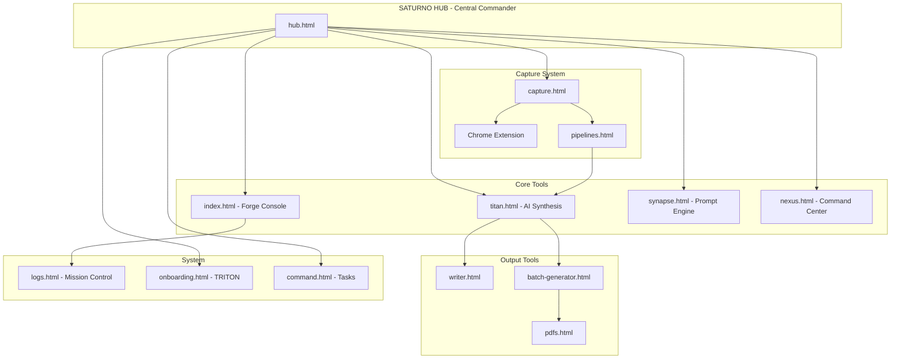

# TITAN FORGE V1.2

**Complete Saturno Tooling Arsenal - AI Synthesis + Capture + Pipelines + BEAST API Backend**

## Live Demo
[**https://gabosaturno11.github.io/titan-forge/**](https://gabosaturno11.github.io/titan-forge/)

## FULL ARSENAL

| App | Description | Link |
|-----|-------------|------|
| **APSIS NEXUS** | Command center - all tools unified | [Open](https://gabosaturno11.github.io/titan-forge/nexus.html) |
| **TITAN V1.2** | AI synthesis + PDF export | [Open](https://gabosaturno11.github.io/titan-forge/titan.html) |
| **SYNAPSE** | Prompt synthesis engine | [Open](https://gabosaturno11.github.io/titan-forge/synapse.html) |
| **CAPTURE** | Highlights, audio, screenshots | [Open](https://gabosaturno11.github.io/titan-forge/capture.html) |
| **PIPELINES** | Visual workflow automation | [Open](https://gabosaturno11.github.io/titan-forge/pipelines.html) |
| **BATCH GENERATOR** | CSV to 100 PDFs | [Open](https://gabosaturno11.github.io/titan-forge/batch-generator.html) |
| **SATURNO FORGE** | Main console with voice modes | [Open](https://gabosaturno11.github.io/titan-forge/) |
| **APOAPSIS Writer** | Double-panel markdown editor | [Open](https://gabosaturno11.github.io/titan-forge/writer.html) |
| **Mission Logs** | Task tracking & timeline | [Open](https://gabosaturno11.github.io/titan-forge/logs.html) |
| **TRITON Onboarding** | 10-question identity sequence | [Open](https://gabosaturno11.github.io/titan-forge/onboarding.html) |

## BACKEND

| Service | URL | Status |
|---------|-----|--------|
| **BEAST API** | https://saturno-beast-api.vercel.app | LIVE |

Endpoints: /api/health, /api/capture, /api/sessions, /api/transcribe, /api/synthesize, /api/pipeline

---

## CHROME EXTENSION

**SATURNO CAPTURE** - Highlight text on ANY website

Location: `saturno-capture-extension/`

### Install
1. Go to `chrome://extensions`
2. Enable Developer mode
3. Click "Load unpacked"
4. Select the `saturno-capture-extension/` folder

### Features
- 8 color categories (idea, quote, code, insight, todo, book, research, thought)
- Floating capture button on text selection
- Tags system
- Highlight persistence (highlights stay on page revisit)
- Export JSON or Markdown (right-click Export)
- Syncs to NEXUS backend
- Syncs to Notion (optional)

### Keyboard Shortcuts
- `Cmd+Shift+S` - Capture selection
- `Escape` - Close modal
- `Cmd+Enter` - Save capture

---

## NEXUS COMMAND CENTER

Central dashboard showing:
- All deployed tools
- Session history (from SESSION_CARDS/)
- Recent learnings (capture cards)
- Gabo preferences
- Pending tasks
- API status

---

## Voice System

8 Modes: `/RawMode`, `/TeacherMode`, `/ProphetMode`, `/PhilosopherMode`, `/MysticMode`, `/RebelMode`, `/CompanionMode`, `/ConfessorMode`

### Master Faders
- F1: Certainty (0-10)
- F2: Formality (0-10)
- F3: Intensity (0-10)
- F4: Intimacy (0-10)
- F5: Abstraction (0-10)
- F6: Density (0-10)

---

## Files

```
titan-forge/
├── index.html                 # Main Forge console
├── titan.html                 # TITAN V1.2 (AI + PDF)
├── nexus.html                 # APSIS NEXUS command center
├── synapse.html               # Prompt synthesis
├── capture.html               # Web capture tool
├── pipelines.html             # Visual workflows
├── batch-generator.html       # Batch PDF generator
├── writer.html                # APOAPSIS writer
├── onboarding.html            # TRITON sequence
├── logs.html                  # Mission control
├── js/
│   ├── api-config.js          # API key management
│   └── claude-api.js          # Claude API integration
├── saturno-capture-extension/ # Chrome extension
│   ├── manifest.json
│   ├── content.js
│   ├── content.css
│   ├── background.js
│   ├── popup.html
│   ├── popup.js
│   └── icons/
└── README.md
```

---

## Design Rules

```css
background: #0a0a0a;
font-family: 'JetBrains Mono', monospace;
accent: #00ffcc;
```

- Dark theme only
- No emojis in UI (custom icons only)
- No gradients (unless blue/purple for special elements)
- No rounded corners > 4px
- Industrial aesthetic
- "If it can exist without a box, do not box it"

---

## Capture -> Card -> Pipeline Flow

```
[CAPTURE]              [CARD]                [PIPELINE]
Highlight    -->    Categorized     -->    Routed to:
Screenshot   -->    Tagged          -->    - Notion
Voice        -->    Timestamped     -->    - Content queue
Quick note   -->    Stored          -->    - AI processing
                                           - Export
```

Rails prevent automation chaos. Every card needs human approval before mass execution.

---

## System Vector Map

How all tools connect:



---

## Logging Protocol

ALL changes must be documented in [Mission Logs](logs.html):

1. Before making changes: Check existing logs
2. After completing work: Add entry with:
   - Timestamp
   - What was changed
   - Files affected
   - Status (success/pending/active)

This ensures continuity between AI sessions and human review.

---

**Creator:** Gabo Saturno
**Stack:** Claude Code + BEAST API + Vercel
**Updated:** February 4, 2026
**Status:** LIVE
